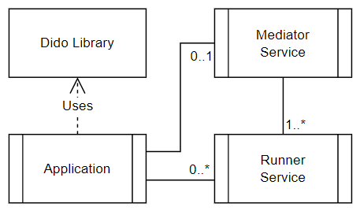
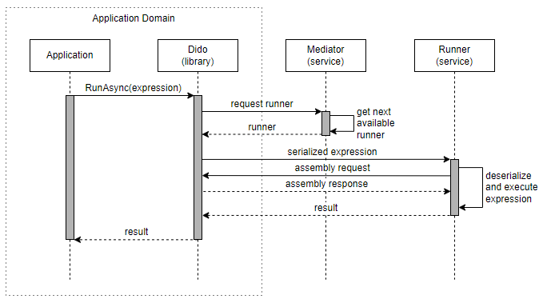
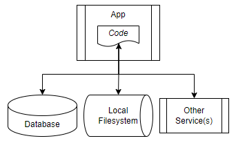
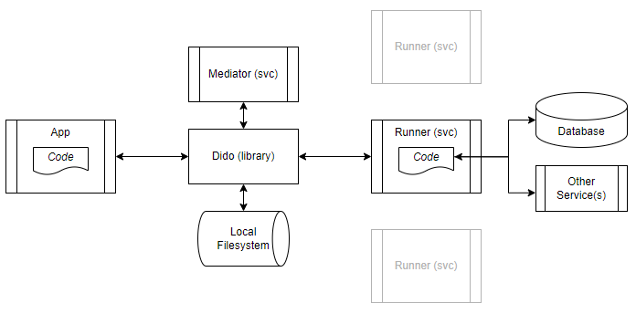

### Dido (Latin) /dēdō/ *verb*: distribute, disseminate, divide, spread.

### _Table of Contents_
- [Summary](#summary)
- [Basic Example](#basic-example)
- [Background](#background)
- [Typical Use Cases](#typical-use-cases)
- [Samples](#samples)
- [Docker](#docker)
- [Technical Discussion](#technical-discussion)
    - [Architecture](#architecture)
    - [Execution Modes](#configurable-execution-modes)
        - [Baseline Execution](#baseline-execution)
        - [Local Execution](#local-execution)
        - [Dedicated Runner Execution](#dedicated-runner-execution)
        - [Clustered Runner Execution](#clustered-runner-execution)
    - [Security](#security)

# Summary

Dido is a .NET framework to facilitate incorporating distributed computing patterns directly into an application without the overhead of authoring, releasing, or maintaining multiple services or executables. Code can be executed locally within the application domain or remotely in a different environment (or potentially on a different OS), in any combination, using a single, configurable API. In this manner, its goal is similar to the .NET [Task Parallel Library](https://docs.microsoft.com/en-us/dotnet/standard/parallel-programming/task-parallel-library-tpl) (TPL) to easily add parallel and distributed computing capability directly to existing code (often with no refactoring), but with code execution unconstrained by the local system.

# Basic Example

```
class MyWork
{
  public static bool DoSomethingLongAndExpensive()
  {
     // TODO: allocate huge amounts of memory, utilize 100% CPU, etc...
     return true;
  }
}

class MyApp
{
  public async Task MyMain()
  {
    var config = new DidoNet.Configuration { /* ...configure... */ };
    // depending on the configuration, the lambda expression below will
    // either run locally or in a generic remote runner service.
    var result = await DidoNet.Dido.RunAsync(
       (context) => MyWork.DoSomethingLongAndExpensive(),
       config
    );
  }
}
```

In this example `MyWork.DoSomethingLongAndExpensive` is a method that takes a long time to complete or requires a large amount of resources. When the method is invoked via Dido in `MyApp.MyMain`, depending on the configuration the method may either run locally within the application process or remotely in a different compute environment. This allows an otherwise monolithic application to easily utilize a distributed computing solution to improve performance with minimal developer effort and overhead.

# Background

At the most basic level, the Dido framework targets the distributed computing problem space where there is a need to develop, test, and deploy an application that performs CPU- and memory-intensive calculations but those calculations should not or can not be performed on the machine or in the environment of the host application, usually due to resource constraints. In more complex scenarios, with proper configuration and an available pool of generic Dido services, other use cases such as a jobs system or a service-oriented system of microservices are also possible from a single governing monolithic application.

The most common traditional solutions for distributed computing problems are to create one or more auxiliary (micro)services, a generic job processing system, or use cloud platforms (eg AWS, Azure, GCP), where the host application orchestrates and communicates with the auxiliary systems to perform the necessary work. These solutions are powerful and flexible, but increase overall application complexity and typically require specific developer expertise and IT administrative overhead, such as:
- Experience with distributed communication and synchronization patterns.
- Experience designing, authoring, and deploying multiple unique auxiliary services.
- Developing and troubleshooting communications and security protocols.
- Updating, migrating, and maintaining multiple services as data models and algorithm needs change.
- Debugging a large or complex distributed system.

The Dido framework offers a potential improvement for some of these areas by inverting the traditional approach and allowing the application to be written as a single conceptual monolith, where it explicitly contains all necessary code (models, data structures, algorithms, assemblies, etc) to perform **all** needed work, and where distributed or non-local invocation of that code is desired, a single API call can securely pack and ship the code to a generic .NET host runner service for execution.

This solution is similar to the legacy/deprecated .NET Remoting or general RPC pattern with a crucial difference: all code is specifically and intentionally only authored and contained in the host application - it does not need to be explicitly and proactively "split" into services or auxiliary applications or plugins, it does not require an intermediate compilation or code generation step, and it does not require proactive developer or IT management to handle new code versions. The code can be directly authored, tested, and executed in the application in a single local environment during development, and then implicitly and dynamically executed remotely on one or more distributed generic "runner" services in production.

Note: while Dido can be a powerful and flexible solution for some common distributed computing use cases, it is not intended to be a panacea, nor replace dedicated and optimized solutions for specific problems.

# Typical Use Cases

- Immediate asynchronous remote execution: TODO
- Deferred asynchronous remote execution with result callback: TODO
- Queued remote execution: TODO
- Job management system with cached results: TODO
- Pseudo-micorservices: TODO

# Samples
- [Basic app (.NET 6)](Samples/SampleApp)
- [Basic app (.NET Core 3.1)](Samples/SampleAppCore3.1)
- [File compressor (.NET 6)](Samples/SampleFileCompressor)
- [Video transcoder (.NET 6)](Samples/SampleVideoTranscoder)

# Docker
TODO: Runner dockerfile
TODO: Mediator dockerfile

# Technical Discussion

## Architecture



The Dido framework is implemented in .NET 6.0 and consists of:
- A Library containing the API, configuration models, and key data structures and utilities.
- A Mediator Service which serves as a pseudo load balancer and which coordinates access to a pool of generic runner instances (available as a console app, OS service, or docker image).
- Generic and identical Runner Service(s) that communicate with the host application (via the Library) and optional mediator instance to execute application code (available as a console app, OS service, or docker image).

Without a mediator nor runner, the Dido API degenerates to local execution, which is no different than executing code without using the framework. Alternatively, exactly one runner can be used without a mediator for simple scenarios with limited or more predictable remote computing needs. Finally, a mediator can be used with one or more runners for more advanced or demanding distributed computing scenarios.

Although a variety of different use cases are supported via appropriate configuration, the nominal functional operation is represented by the following sequence diagram:



1. The application requests to execute an expression using a Dido API method.
2. The Mediator is contacted to find an available runner.
3. The expression is serialized and transmitted to the runner.
4. The runner deserializes the expression and attempts to instantiate and execute it.
5. Inevitably, the expression requires application and dependency assemblies that do not yet exist in the runner domain (or whose previously cached version is out of date), so those assemblies are securely transmitted to the runner.
6. Once all assemblies are available and loaded, the expression is executed.
7. The expression result is transmitted back to the application.

## Configurable Execution Modes

### Baseline Execution


```
myObj.DoWork();
```

Without using Dido, the application nominally contains code performing some function. This code may simply utilize local resources such as CPU and memory, or may use the file-system, a database, or other connected services.


### Local Execution


```
config.ExecutionMode = ExecutionModes.Local;
Dido.RunAsync((ctx) => myObj.DoWork(), config);
```

When a Dido API method is configured for Local Execution, execution of code degenerates to the baseline: it is equivalent to not using Dido at all. This can greatly enhance the ability to develop and debug an application because all code is executing locally; allowing monitoring, breakpoints, etc.


### Dedicated Runner Execution


```
config.ExecutionMode = ExecutionModes.Remote;
config.RunnerUri = "https://localhost:4940";
Dido.RunAsync((ctx) => myObj.DoWork(ctx), config);
```

When a Dido API method is configured for Remote Execution with a single runner, the code is executed remotely. Depending on the runner environment, this may mean access to more (or at least dedicated) resources than is available in the host application environment. As long as the application code is parameterized with connection strings or other necessary credentials, and the runner environment properly configured to allow those network connections, the code can access databases and other services normally, with no special handling. However, file-system access must use proxy IO instances exposed by the Dido runtime execution context which wrap underlying connections to properly marshal data between the runner and host application file-system.

### Clustered Runner Execution


```
config.ExecutionMode = ExecutionModes.Remote;
config.MediatorUri = "https://localhost:4940";
Dido.RunAsync((ctx) => myObj.DoWork(ctx), config);
```

When a Dido API method is configured for Remote Execution with a mediator, the code is executed remotely using the best available runner that matches configured filter criteria, but otherwise identical to the dedicated runner scenario described above. When paired with appropriate monitoring and auto-scaling solutions such as Kubernetes, the runner pool can dynamically adjust to load conditions from one or more applications, with no configuration nor code changes required by the application.

## Runner
TODO

## Mediator
TODO

## Security
TODO: SSL certificate installation & configuration
